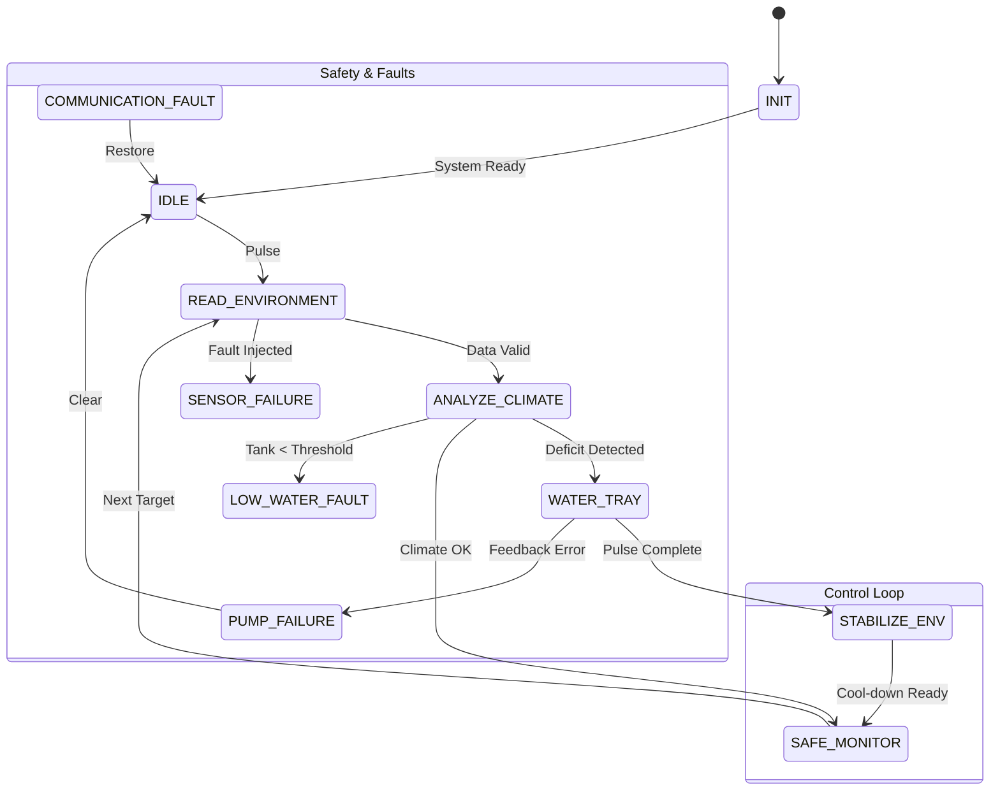

# MicroGreenTwin - Smart Microgreens Automation 🪴

MicroGreenTwin is a high-reliability Digital Twin platform for automated microgreen farming. It combines real-time IoT telemetry, formal Finite State Machine (FSM) control logic, and predictive biological modeling to ensure optimal growth and system resilience.

## 🚀 Key Features

- **Digital Twin Integration**: Seamless bidirectional mirroring between physical sensors and the virtual dashboard.
- **Advanced Control System**: 
  - **PID-Lite Controller**: Precision proportional control with adaptive gains adjusted for real-time evaporation rates.
  - **Validation Engine**: Real-time RMSE and MAE metrics to assess model confidence.
- **Reliability Lab**: A sophisticated fault injection system simulating Sensor Failure, Pump Malfunctions, Tank Depletion, and Communication Loss.
- **Predictive Analytics**: 24-hour forecasting using climate-aware biological models to anticipate irrigation needs.
- **Hardware Link**: Production-ready serial interface for ESP8266/ESP32 hardware, implementing high-speed JSON telemetry.
- **Adaptive Models**: Self-correcting calibration factors that learn from sensor drift over time.

## 🏗️ System Architecture (FSM)

The system is built on a formal state machine to ensure deterministic behavior and safety.



## 🛠️ Technology Stack

- **Frontend**: React 18, TypeScript, Vite
- **UI Framework**: Tailwind CSS, shadcn/ui
- **Control Theory**: Custom PID-Lite implementation
- **Hardware Integration**: Web Serial API
- **Testing**: Vitest (Unit & Integration)

## 📦 Getting Started

### Prerequisites

- [Node.js](https://nodejs.org/) (v18+)
- Compatible ESP8266/ESP32 board (for physical integration)

### Installation

1. Clone the repo:
   ```bash
   git clone https://github.com/yourusername/MicroGreenTwin.git
   ```

2. Navigate to the project directory:
   ```bash
   cd MicroGreenTwin
   ```

3. Install dependencies:
   ```bash
   npm install
   ```

4. Start development server:
   ```bash
   npm run dev
   ```

## 📜 License

Distributed under the MIT License. See `LICENSE` for more information.

---
*Developed for Advanced Digital Logic Design (ADLD) standards.*
